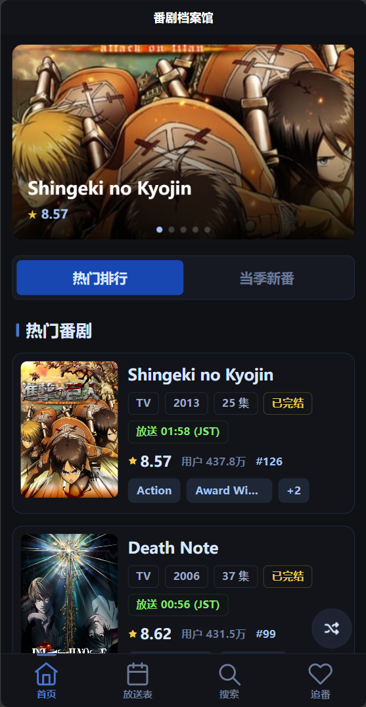
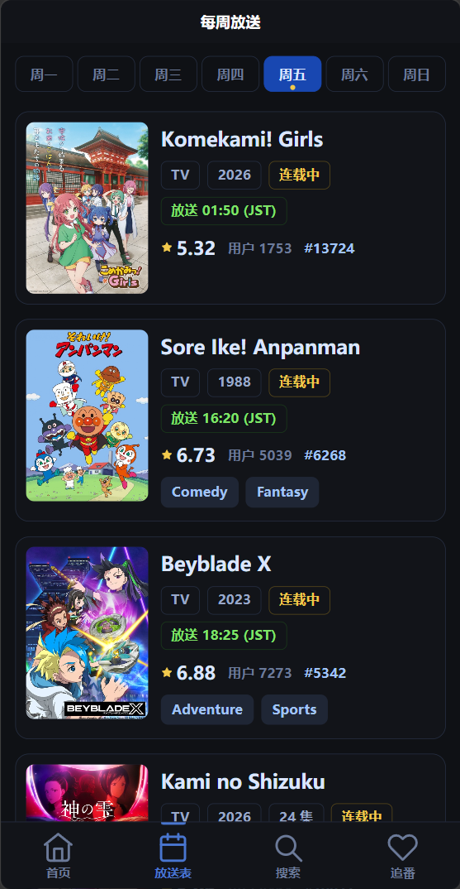
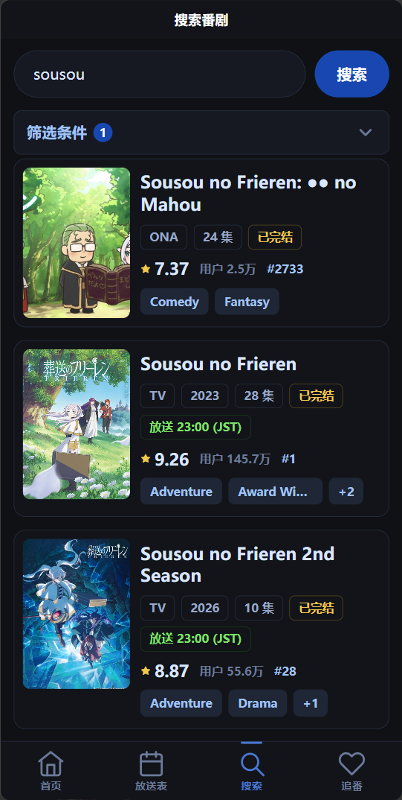
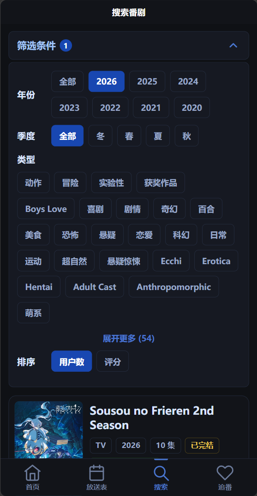
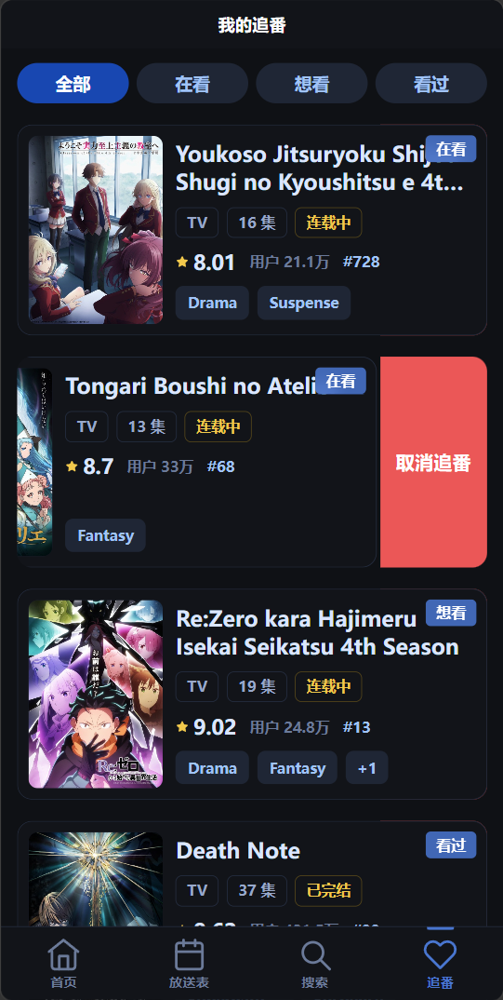
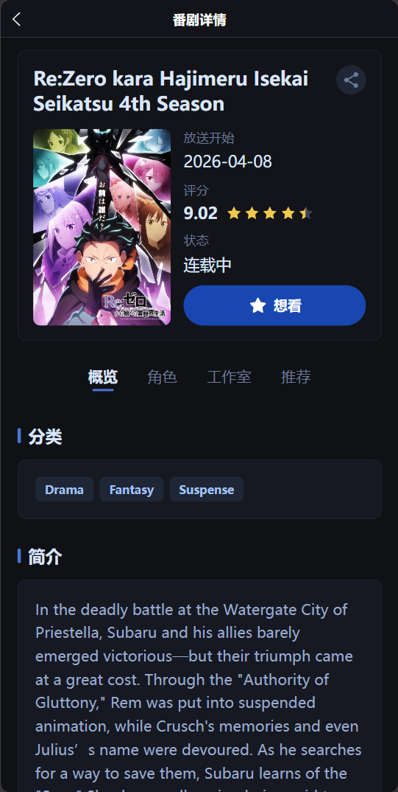
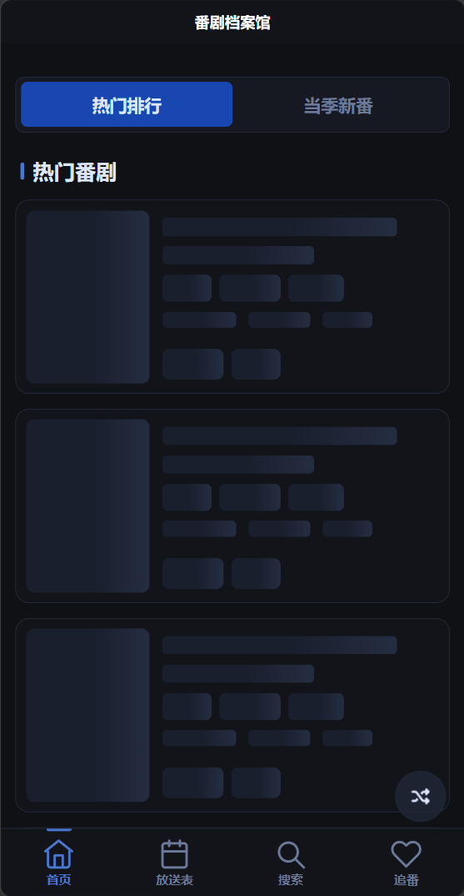
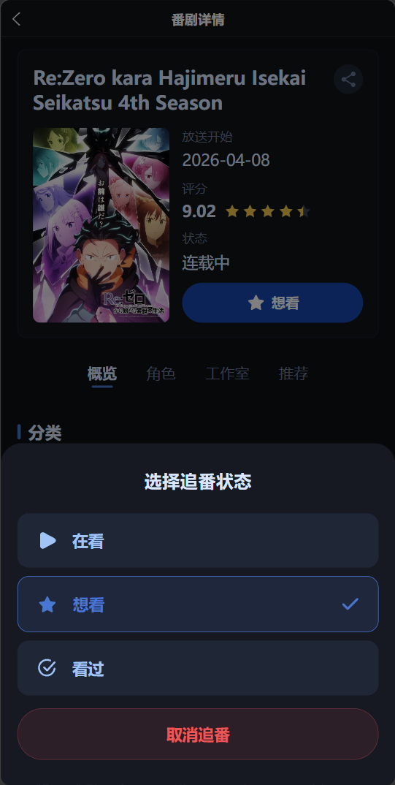

# 番剧档案馆 AnimeTool

番剧档案馆是一个基于 uni-app 和 Vue 3 开发的移动端番剧资料浏览应用。项目通过 Jikan v4 API 获取 MyAnimeList 番剧数据，提供热门番剧、搜索筛选、每周放送表、番剧详情和追番收藏等功能，适合作为番剧信息查询与个人追番管理工具。

## 效果截图

















## 项目功能

- 热门番剧浏览：按人气获取番剧列表，支持下拉刷新和分页加载。
- 番剧搜索与筛选：支持关键词搜索，并可按年份、季度、类型、排序条件筛选番剧。
- 每周放送表：按星期查看番剧放送信息，便于快速了解当季更新安排。
- 番剧详情：展示封面、评分、排名、类型、集数、简介、制作公司、角色和相关推荐。
- 追番收藏：支持添加、取消收藏，并按“在看 / 想看 / 看过”分类管理。
- 移动端体验：包含自定义底部导航、骨架屏、空状态、加载更多、返回顶部等交互组件。

## 技术栈

| 分类 | 技术 |
| --- | --- |
| 跨端框架 | uni-app |
| 前端框架 | Vue 3、`<script setup>` |
| 状态管理 | Pinia、pinia-plugin-persistedstate |
| 数据来源 | Jikan v4 API |
| 网络请求 | `uni.request` Promise 封装 |
| 样式 | SCSS、rpx 响应式单位 |
| 测试 | Node.js native test runner、`node:assert/strict` |
| 开发工具 | HBuilderX |

## 项目架构

```text
AnimeTool/
  api/
    anime.js                    # Jikan API 调用层，统一返回规范化后的数据
  utils/
    request.js                  # uni.request Promise 封装与错误处理
    normalizeAnime.js           # 番剧基础与详情数据规范化
    normalizeAnimeExtras.js     # 角色、推荐数据规范化
    genreMap.js                 # 类型中文映射
    animeCardMeta.js            # 卡片展示字段格式化
  stores/
    favorite.js                 # Pinia 追番收藏状态与持久化
  composables/
    usePagedApi.js              # 通用分页加载逻辑
    useNavigation.js            # 页面跳转封装
    useFadeIn.js                # 渐入动画状态封装
    useBackToTop.js             # 返回顶部逻辑封装
  components/
    AnimeCard.vue               # 番剧卡片
    CustomTabBar.vue            # 自定义底部导航
    LoadingMore.vue             # 分页加载状态
    EmptyState.vue              # 空状态
    SkeletonCard.vue            # 骨架屏
    RandomRecommend.vue         # 随机推荐
    BackToTop.vue               # 返回顶部
    detail/                     # 详情页局部组件
    favorite/                   # 收藏页局部组件
  pages/
    index.vue                   # 首页热门番剧
    search.vue                  # 搜索与筛选页
    favorite.vue                # 我的追番页
    detail.vue                  # 番剧详情页
    schedule.vue                # 每周放送表
  tests/
    *.test.mjs                  # 纯逻辑单元测试
```

### 分层设计

项目采用“页面调度、接口集中、工具纯化、组件展示”的分层方式：

```text
pages/*.vue
  -> api/anime.js
    -> utils/request.js
    -> utils/normalize*.js
  -> stores/favorite.js
  -> composables/use*.js
  -> components/*.vue
```

- 页面负责生命周期、用户交互和页面级状态组织。
- API 层集中对接 Jikan v4，不在页面或组件中重复请求逻辑。
- 工具层负责数据清洗、字段映射、类型翻译和展示字段格式化。
- 组件只接收 props 并触发事件，不直接调用接口。
- 收藏数据统一通过 Pinia store 管理，页面不直接操作 `uni.storage`。

## 核心模块说明

### API 层

`api/anime.js` 封装了热门番剧、当季新番、每周放送、搜索筛选、番剧详情、角色、相关推荐和随机推荐等接口。列表接口统一返回：

```js
{
  list: [],
  pagination: {}
}
```

详情接口返回单个规范化后的番剧对象，保证页面可以使用稳定的数据结构渲染。

### 数据规范化

Jikan API 返回字段较多，且字段命名、空值和嵌套结构不完全适合页面直接使用。项目通过 `utils/normalizeAnime.js` 和 `utils/normalizeAnimeExtras.js` 将原始响应转换为应用内部统一模型，例如：

- `mal_id` 转换为 `id`
- `images.jpg` 中的图片地址转换为 `image`
- 简介文本移除 HTML 标签和 MyAnimeList 元信息
- 类型、角色、推荐等列表过滤非法数据
- 番剧类型名称通过映射表转换为中文展示

### 收藏状态管理

`stores/favorite.js` 使用 Pinia 管理追番数据，并通过 `pinia-plugin-persistedstate` 持久化到 `uni.storage`。收藏条目只保留列表展示和分类管理需要的字段，避免将完整详情数据写入本地存储。

收藏分类包括：

- 在看
- 想看
- 看过

### 分页加载复用

`composables/usePagedApi.js` 抽离了列表页常见的分页逻辑，包括：

- loading 锁，避免重复请求
- 页码递增
- 下拉刷新重置数据
- 加载更多状态切换
- 请求失败 toast 提示

首页、搜索页、放送表等页面可以复用同一套分页行为，减少重复代码。

## 技术难点

### 1. 第三方 API 数据结构适配

Jikan v4 的数据来自 MyAnimeList，字段层级较深，部分字段可能为空或格式不稳定。项目没有在页面中直接消费原始数据，而是在 API 层之后统一进行 normalize 处理，使组件和页面只依赖稳定的应用数据模型，降低页面渲染时的空值判断复杂度。

### 2. 搜索、筛选与分页的组合

搜索页需要同时处理关键词、年份、季度、类型和排序条件，并且还要支持分页加载。项目将筛选参数构造成 Jikan API 可识别的查询参数，并复用通用分页 composable，保证筛选条件变化时可以从第一页重新加载，滚动触底时继续加载下一页。

### 3. 收藏数据持久化与分类管理

收藏功能既要支持快速判断某个番剧是否已收藏，也要支持分类切换和本地持久化。项目通过 Pinia store 封装 `isFavorite`、`addFavorite`、`removeFavorite`、`setCategory` 等操作，页面只调用业务方法，不直接关心存储细节。

### 4. 移动端交互体验

应用面向移动端使用场景，需要处理页面滚动、触底加载、下拉刷新、空状态、加载状态和自定义 tabBar 等细节。项目将这些交互拆分为可复用组件和 composable，使页面结构更清晰，也便于后续维护。

### 5. 组件解耦与展示逻辑复用

番剧卡片、评分、分类选择、收藏滑动操作等组件只负责展示和事件传递，不直接请求数据。排名、观看人数、类型展示等格式化逻辑集中在工具函数中，避免多个组件重复实现相同展示规则。

### 6. 纯逻辑单元测试

uni-app 项目的构建和预览依赖 HBuilderX，但数据规范化、收藏 store helper、卡片展示字段等逻辑可以脱离运行环境测试。项目使用 Node.js 原生测试运行器编写 `.mjs` 测试文件，提升核心逻辑的可靠性。

## 运行方式

### 安装依赖

```bash
cd AnimeTool
npm install
```

### 启动项目

本项目通过 HBuilderX 运行和预览：

1. 使用 HBuilderX 打开 `AnimeTool` 目录。
2. 根据目标平台选择运行到浏览器、模拟器或移动端设备。
3. HBuilderX 会根据 uni-app 配置完成编译和预览。

项目未配置标准 Vite / Webpack 启动脚本，因此不使用 `npm run dev` 启动。

### 运行测试

```bash
npm test
```

运行单个测试文件：

```bash
node --test tests/normalizeAnime.test.mjs
```

## 开发规范

- 使用 Vue 3 `<script setup>` 语法。
- 生命周期钩子从 `@dcloudio/uni-app` 引入。
- 页面跳转使用 `uni.navigateTo`，图片预览使用 `uni.previewImage`。
- 页面通过 `api/anime.js` 获取数据，不直接调用 `uni.request`。
- 组件不直接调用 API，只通过 props 和 emit 与页面通信。
- 页面不直接操作本地存储，收藏数据统一通过 Pinia store 管理。
- UI 文案使用中文。
- 工具函数保持纯函数，便于单元测试。
- 新增公共逻辑优先抽离到 `utils/` 或 `composables/`，避免重复实现。

## 测试覆盖

当前测试主要覆盖纯逻辑模块：

- 番剧数据规范化
- 角色与推荐数据规范化
- 类型中文映射
- 番剧卡片展示字段
- 收藏 store helper

测试文件位于 `AnimeTool/tests/`，采用 Node.js 原生测试运行器，无需浏览器环境即可执行。

## 数据来源说明

本项目数据来自 Jikan v4 API。Jikan 是 MyAnimeList 的非官方公开 API，接口可用性、请求频率限制和返回内容可能受到第三方服务影响。项目通过统一请求封装和错误提示降低接口异常对用户体验的影响。

## 项目总结

番剧档案馆围绕番剧浏览、筛选、详情查看和追番收藏构建了一套较完整的移动端应用流程。项目重点不只是页面展示，还包括第三方 API 数据适配、状态持久化、分页复用、组件解耦和纯逻辑测试，整体结构清晰，便于后续继续扩展评分记录、观看进度、标签管理等功能。
